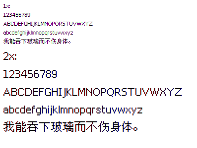

# PCF2TTF

从 pcf 字体文件中读取位图字形，并使用 `OpenType.js` 生成对应的像素矢量字形。

下面是我使用文泉驿点阵宋体生成的 TTF 字体效果。
实际字体大小为 15px（ascent=13, descent=2），行高为 18px。



`OpenType.js` 生成字体时如果字符过多（使用文泉驿点阵宋体，编码范围在 0-20000 或更多时），生成的 otf 文件会有错误，浏览器无法直接使用，且在 FontForge 中打开时报错：

```
Internal Error
This font has an illegal format 4 subtable width too little space for all the segments(1552)
This error is not recoverable
By
```

不过似乎在 FontForge 中重新导出字体文件后会正常，原因待排查。
