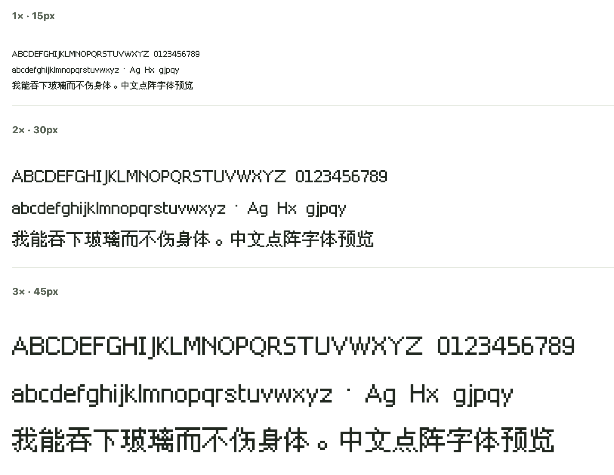

# PCF2TTF

将 PCF 点阵字体转换为带像素轮廓的 TrueType 字体。



## 安装与运行

```sh
pnpm install
pnpm build
pnpm start --help

pnpm start assets/wenquanyi_9pt.pcf -o ./wenquanyi.ttf \
  --family "WenQuanYi Pixel Song" --style Medium
```

这条命令会同时生成 `wenquanyi.ttf` 和 `wenquanyi.html`。HTML 内嵌本次生成的字体，无需服务器，双击即可离线预览；支持修改文字、字号、行高，显示基线辅助线和字体度量。

开发时直接运行 TypeScript：

```sh
pnpm dev assets/wenquanyi_9pt.pcf -o ./wenquanyi.ttf
```

安装本地打包产物后，可以直接使用 `pcf2ttf` 命令：

```sh
pnpm pack
npm install --global ./pcf2ttf-1.0.0.tgz
pcf2ttf --help
```

`build/` 保存 TypeScript 编译结果；`dist/` 保留原仓库中的字体和 HTML 演示。

## CLI

```text
pcf2ttf [options] <input.pcf[.gz]>
```

| 参数 | 说明 |
| --- | --- |
| `-o, --output <path>` | 输出 `.ttf` 路径；默认在输入文件旁生成同名 TTF |
| `-f, --family <name>` | 字体家族名；默认读取 PCF `FAMILY_NAME`，缺失时使用 `PCF Pixel Font` |
| `--style <name>` | 样式名，默认 `Regular`；识别 Bold、Medium、Italic、Oblique 元数据 |
| `-s, --scale <integer>` | 每个点阵像素对应的字体单位数，默认 `100` |
| `--assume-unicode` | 明确将 PCF 原始字符编码当作 Unicode；不会进行字符集转码 |
| `--force` | 允许覆盖已有 TTF 和 HTML 输出文件 |
| `-h, --help` | 显示帮助 |
| `-v, --version` | 显示版本 |

支持 `.pcf` 和 gzip 压缩的 PCF（按文件内容识别压缩格式）。输出目录须已存在，输出扩展名须为 `.ttf`。HTML 位于 TTF 旁，使用相同文件名（扩展名为 `.html`）。输入、TTF、HTML 必须是不同文件；拒绝符号链接输出，以及与输入或另一输出相同的硬链接。写入前会检查两个输出路径。默认拒绝覆盖已有文件；参数或转换失败时向 stderr 输出原因，退出码为 `1`，成功为 `0`。

文件路径以 `-` 开头时使用 `--`：

```sh
pcf2ttf --assume-unicode -- -font.pcf
```

PCF 编码不一定是 Unicode。默认接受 `ISO10646-1` 和 `ISO8859-1`；其他字符集以及缺少字符集属性的字体会报错。仅当确认原始编码与 Unicode 一致时使用 `--assume-unicode`。GB2312、Big5、JIS 等字体需要先转码，否则会产生错误的字符映射。

`unitsPerEm = (fontAscent + fontDescent) × scale`，必须为 `16–16384`；超出轮廓、字宽、字形数量或 `cmap` 的表示范围时会明确报错。当前输出使用 BMP format-4 cmap，不支持代理码点、U+FFFF、超过 65,534 个编码字形，或超过 8,188 个不连续编码区间。连续 Unicode 字符会合并为 cmap 区间，因此大字符集本身不会导致旧实现中的表长度溢出。

## 作为 ESM 库使用

```ts
import { readFile, writeFile } from 'node:fs/promises'
import { convertPcfToTtf, getGlyphBitmap, loadPcf } from 'pcf2ttf'

const input = await readFile('./font.pcf')
const output = convertPcfToTtf(input, {
  familyName: 'Pixel Song',
  styleName: 'Regular',
  scale: 100,
})
await writeFile('./font.ttf', output)

const font = await loadPcf('./font.pcf')
const glyphIndex = font.encoding.glyphIndices.get(0x4e2d)
if (glyphIndex !== undefined) {
  console.log(getGlyphBitmap(font, glyphIndex).join('\n'))
}
```

导出 `parsePcf(Uint8Array)`、`loadPcf(path)`、`getGlyphBitmap(font, glyphIndex)`、`createTtf(font, options)`、`convertPcfToTtf(input, options)` 及相应类型。位图以自上而下的字符串行返回，`#` 表示像素，空格表示空白，不包含行填充位。`encoding.glyphIndices` 是实际字符编码到无符号字形索引的 Map；`0xffff` 缺失项不在 Map 中。

库的导入没有文件读写副作用。旧的 `src/*.mjs` 脚本与 `genGlyphArray` 已移除，解析数据统一改为 camelCase 类型化结构。

## 格式处理与修复

- 表头始终按小端读取，各表整数只由字节序标志决定；独立处理位序、扫描单元以及 1/2/4/8 字节行填充。
- 支持压缩与非压缩 metrics、属性、位图、编码、两种 accelerator、ink metrics、scalable widths 和可选字形名称。
- 正确处理非零编码起点、双字节编码范围、大于 32767 的字形索引、共享或乱序字符串偏移，以及缺失的可选表。
- 检查表边界、格式、计数、字符串终止符和位图偏移，兼容 `bdftopcf` 末尾表长度偏大的文件。输入及解压后大小上限为 64 MiB。
- 位图尺寸取自普通 metrics，优先使用 BDF accelerator 的全局度量。轮廓保留左边距、基线和下伸部，合并共线边，每条轮廓独立闭合；空洞与外轮廓方向相反，对角接触像素保持独立。
- 使用迭代轮廓遍历，避免长轮廓递归溢出。为 TTF 保留字形零 `.notdef`，按 Unicode 顺序排列编码字形并保留编码别名。
- 用 `fonteditor-core` 生成 TrueType，替换旧的 `opentype.js` CFF 导出。字宽来自点阵 metrics；scalable widths 仅作为源数据保留，不用于改变像素比例。

字体未添加 hinting。建议在源字体实际高度的整数倍显示；`scale` 改变字体单位精度，不改变同一字号下的像素比例。

## Ascent、descent 与 baseline

TTF 的基线位于 **y=0**，向上为正。点阵第 `row` 行像素上边缘的坐标为 `(glyph.ascent - row) × scale`，下边缘再减一个 `scale`；因此字形底边为 `-glyph.descent × scale`。字形自己的 ascent/descent 决定轮廓位置，不能用全局 fontAscent 替换，否则不同高度的字形会错位。单字形 descent 可以为负，表示它整体在基线上方。

全局逻辑度量按 BDF accelerator → 普通 accelerator → `FONT_ASCENT` / `FONT_DESCENT` 属性 → 已编码字形 metrics 的顺序取值。缺少 accelerator 时，不让未编码的字形改变输出行高。

- `hhea.ascent` 和 `OS/2.sTypoAscender` 为正；对应 descent 写入负值。
- 两组 `lineGap` 都为 0，并设置 `USE_TYPO_METRICS`。默认逻辑行高为 `ascender - descender + lineGap`，本项目恰好等于 `unitsPerEm`。
- `usWinAscent` / `usWinDescent` 都为非负值，并覆盖所有输出字形的实际轮廓，以避免 Windows 裁切。它们不应反过来改变基线或字体缩放。
- `sxHeight` / `sCapHeight` 优先使用 PCF 的 `X_HEIGHT` / `CAP_HEIGHT`；缺失时分别取 x / H 的实际轮廓顶部，无对应字形则为 0。
- CSS `line-height` 与字体自身的逻辑高度是两回事。额外行高通常分配到文字上下两侧；即使字体的防裁切范围足够，过小的 CSS 行高仍可能使相邻行重叠。

仓库样本在默认 `scale=100` 下的实际值：

| 属性 | TTF 字体单位 | 源像素 |
| --- | ---: | ---: |
| unitsPerEm | 1500 | 15 |
| ascent / sTypoAscender | 1200 | 12 |
| descent / sTypoDescender | -300 | -3 |
| baseline | 0 | 0 |
| lineGap | 0 | 0 |
| 实际轮廓 yMax / yMin | 1600 / -200 | 16 / -2 |
| usWinAscent / usWinDescent | 1600 / 300 | 16 / 3 |
| x-height / cap-height | 500 / 700 | 5 / 7 |

因此样本的逻辑 ascent/descent 是 **12/3**，不是旧 README 中的 13/2。某些字形上伸到 16 像素是源字体本身的情况，不是 baseline 转换错误。预览页的度量表读取最终 TTF，以便直接检查输出。

## 验证

```sh
pnpm typecheck
pnpm lint
pnpm test
```

测试覆盖 PCF 格式组合、损坏输入、512 种 3×3 位图的填充与轮廓面积、长轮廓、40,000 字符映射、CLI 双输出与覆盖保护、离线 HTML 内嵌内容与交互脚本、baseline/行高度量，以及仓库内文泉驿字体的完整转换。样本有 30,163 个编码字符，输出包含 30,164 个字形（含 `.notdef`）。重构时还使用独立的 FontTools 检查表结构与重新导出，并用 FreeType 在 15px 下逐字验证全部编码字符的像素和前进宽度。


## 参考

- [FontForge：PCF 格式说明](https://fontforge.org/docs/techref/pcf-format.html)
- [FreeType PCF 读取实现](https://github.com/freetype/freetype/blob/master/src/pcf/pcfread.c)与[位图解码实现](https://github.com/freetype/freetype/blob/master/src/pcf/pcfdrivr.c)：用于核对文档中的位序说明和实际兼容行为。
- [OpenType cmap 规范](https://learn.microsoft.com/en-us/typography/opentype/spec/cmap)

- [OpenType OS/2 度量规范](https://learn.microsoft.com/en-us/typography/opentype/spec/os2)与[hhea 规范](https://learn.microsoft.com/en-us/typography/opentype/spec/hhea)
